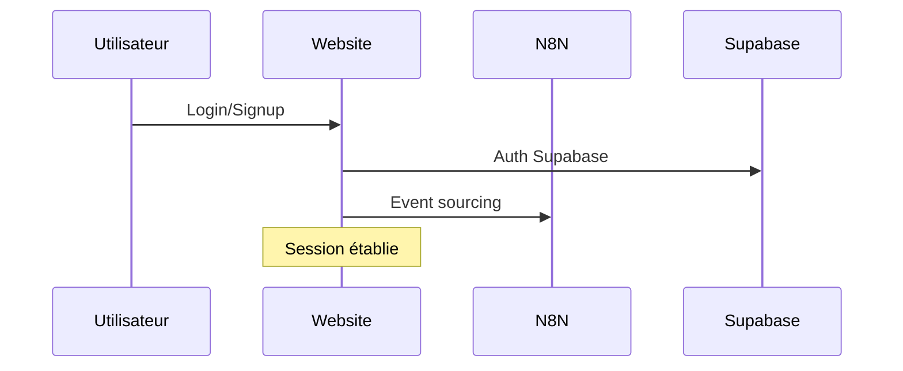
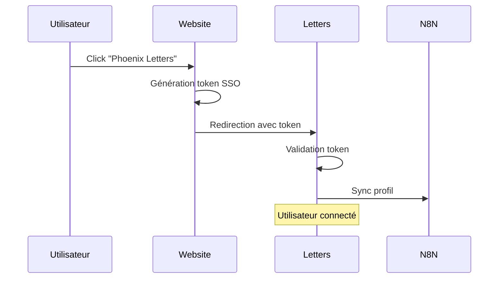
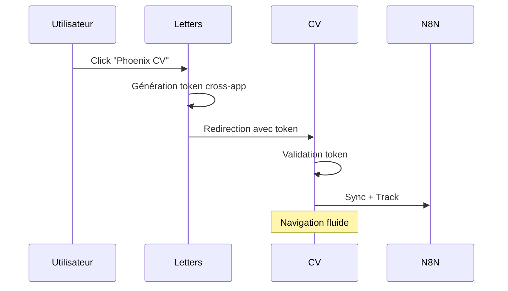

# 🔐 PHOENIX SSO - Guide Complet d'Authentification Unifiée

## 🎯 Vue d'ensemble

Le système SSO Phoenix permet une **authentification unifiée** à travers tout l'écosystème Phoenix : Website (Next.js) → Letters (Streamlit) → CV (Streamlit).

### ✨ Fonctionnalités Principales

- 🔐 **Tokens JWT chiffrés** pour sécurité maximale
- 🔄 **Navigation fluide** entre applications
- ⭐ **Gestion des tiers** (Free, Premium, Enterprise)
- 📊 **Synchronisation profils** automatique
- 💳 **Abonnements centralisés** Stripe
- 🛡️ **Sécurité by design** - RGPD compliant

---

## 🏗️ Architecture du Système

```
🌐 Phoenix Website (Next.js)
        ↓ [Génération token SSO]
📱 Phoenix Letters (Streamlit)
        ↓ [Navigation cross-app]
📄 Phoenix CV (Streamlit)

🔄 Services Partagés:
├── phoenix_sso.py        → Tokens & authentification
├── phoenix_middleware.py → Gestion état unifié
├── profile_sync.py       → Synchronisation profils
└── subscription_manager.py → Abonnements Stripe
```

---

## 🚀 Installation et Configuration

### 1. Structure des Fichiers

```
phoenix_n8n/
├── phoenix_shared/
│   ├── auth/
│   │   ├── __init__.py
│   │   ├── phoenix_sso.py
│   │   ├── phoenix_middleware.py
│   │   └── profile_sync.py
│   └── billing/
│       ├── __init__.py
│       └── subscription_manager.py
├── phoenix-website/
├── phoenix_letter/
└── phoenix_cv/
```

### 2. Variables d'Environnement Requises

```env
# JWT & Encryption
PHOENIX_SECRET_KEY=your-phoenix-secret-key-2024
PHOENIX_ENCRYPTION_KEY=your-encryption-key-base64

# N8N Webhooks
N8N_WEBHOOK_URL=http://localhost:5678

# Stripe
STRIPE_SECRET_KEY=sk_test_...
STRIPE_PREMIUM_MONTHLY_PRICE_ID=price_...
STRIPE_PREMIUM_YEARLY_PRICE_ID=price_...
STRIPE_ENTERPRISE_PRICE_ID=price_...

# Supabase
SUPABASE_URL=https://your-project.supabase.co
SUPABASE_ANON_KEY=your-anon-key
SUPABASE_SERVICE_KEY=your-service-key
```

### 3. Configuration Streamlit Secrets

```toml
# .streamlit/secrets.toml
[default]
PHOENIX_SECRET_KEY = "your-phoenix-secret-key-2024"
PHOENIX_ENCRYPTION_KEY = "your-encryption-key-base64"
N8N_WEBHOOK_URL = "http://localhost:5678"
STRIPE_SECRET_KEY = "sk_test_..."
```

---

## 💻 Utilisation dans les Applications

### 🌐 Phoenix Website (Next.js)

#### 1. Génération de Token SSO

```typescript
// lib/auth.ts
import { phoenixAuth } from './auth';

// Redirection vers Letters
await phoenixAuth.redirectToApp('letters');

// Redirection vers CV  
await phoenixAuth.redirectToApp('cv');
```

#### 2. API Endpoint de Génération Token

```typescript
// app/api/sso/generate-token/route.ts
export async function POST(request: NextRequest) {
  const { user_data, target_app } = await request.json();
  
  // Génération token JWT chiffré
  const payload = { user_id, email, user_tier, target_app, ... };
  const jwtToken = jwt.sign(payload, phoenixSecret, { algorithm: 'HS256' });
  const encryptedToken = encrypt(jwtToken);
  
  return NextResponse.json({ sso_token: encryptedToken });
}
```

### 📱 Phoenix Letters (Streamlit)

#### 1. Intégration SSO dans app.py

```python
# phoenix_letter/app.py
import sys
import os
sys.path.insert(0, os.path.join(os.path.dirname(__file__), '../phoenix_shared'))

from auth.phoenix_sso import phoenix_sso, render_phoenix_navigation

def main():
    # 🚀 GESTION SSO PHOENIX (Priorité absolue)
    phoenix_user = phoenix_sso.handle_streamlit_sso('letters')
    
    if phoenix_user:
        # Utilisateur connecté via SSO
        st.success(f"🔥 Connexion Phoenix réussie ! Bienvenue {phoenix_user.get('email')}")
        
        # Navigation Phoenix dans sidebar
        render_phoenix_navigation('letters')
        
        # Configuration session
        st.session_state.phoenix_user = phoenix_user
        st.session_state.user_tier = phoenix_user.get('user_tier', 'free')
        
        # Rendu application avec contexte Phoenix
        render_main_app(phoenix_user, phoenix_mode=True)
    else:
        # Mode classique/invité
        render_main_app(None, phoenix_mode=False)
```

#### 2. Fonctionnalités Premium Conditionnelles

```python
def generate_letter_premium_features(phoenix_user):
    """Fonctionnalités premium conditionnelles"""
    
    is_premium = phoenix_user and phoenix_user.get('user_tier') == 'premium'
    
    if is_premium:
        # Fonctionnalités premium disponibles
        col1, col2 = st.columns(2)
        
        with col1:
            if st.button("🎯 Analyse ATS Premium"):
                # Logique premium
                pass
        
        with col2:
            if st.button("📊 Coach IA Avancé"):
                # Logique premium
                pass
    else:
        # Invitation upgrade
        st.info("⭐ Fonctionnalités Premium disponibles - Passer Premium")
```

### 📄 Phoenix CV (Streamlit)

#### 1. Intégration SSO

```python
# phoenix_cv/app.py
def main():
    # 🚀 GESTION SSO PHOENIX
    phoenix_user = None
    if SSO_AVAILABLE:
        phoenix_user = phoenix_sso.handle_streamlit_sso('cv')
        
        if phoenix_user:
            st.success(f"🔥 Connexion Phoenix réussie !")
            render_phoenix_navigation('cv')
    
    # Rendu avec contexte
    render_create_cv_page(model, phoenix_user=phoenix_user)
```

#### 2. Pré-remplissage Données Phoenix

```python
def render_create_cv_page(model, phoenix_user=None):
    # Pré-remplissage avec données Phoenix
    default_email = phoenix_user.get('email', '') if phoenix_user else ''
    default_name = phoenix_user.get('full_name', '') if phoenix_user else ''
    
    email = st.text_input("Email *", value=default_email)
    # ...
```

---

## 🔧 Services Avancés

### 🔄 Middleware d'Authentification

```python
from auth.phoenix_middleware import phoenix_middleware

# Initialisation session
user_data = phoenix_middleware.initialize_session('letters')

# Vérification permissions
can_use = phoenix_middleware.check_permission('premium_analysis', 'letters')

# Rendu statut auth
phoenix_middleware.render_auth_status()
```

### 📊 Synchronisation Profils

```python
from auth.profile_sync import sync_phoenix_profile, track_phoenix_activity

# Sync profil
sync_phoenix_profile(user_data, 'letters')

# Track activité
track_phoenix_activity(user_id, 'letters', 'letter_generated')
```

### 💳 Gestion Abonnements

```python
from billing.subscription_manager import subscription_manager

# Récupération abonnement
subscription = subscription_manager.get_user_subscription(user_id)

# Vérification usage
can_generate = subscription_manager.track_feature_usage(user_id, 'letter_generation', 'letters')

# Création checkout
checkout_url = subscription_manager.create_checkout_session(
    user_id, email, 'premium_monthly', success_url, cancel_url
)
```

---

## 🎯 Flux Utilisateur Complet

### 1. Connexion Initial (Website)



### 2. Navigation SSO (Website → Letters)



### 3. Navigation Cross-App (Letters → CV)



---

## 🛡️ Sécurité et Bonnes Pratiques

### 🔐 Sécurité des Tokens

- **JWT + Chiffrement AES** : Double protection
- **Durée de vie courte** : 1 heure par défaut
- **Signature HMAC** : Vérification intégrité
- **Audience spécifique** : Un token par app cible

### 🔒 Protection des Données

- **Pas de stockage local** des tokens
- **Nettoyage automatique** après usage
- **Logs anonymisés** pour debugging
- **HTTPS obligatoire** en production

### ⚡ Gestion des Erreurs

```python
try:
    phoenix_user = phoenix_sso.handle_streamlit_sso('letters')
except Exception as e:
    logger.error(f"Erreur SSO: {e}")
    # Fallback vers mode classique
    phoenix_user = None
```

---

## 📊 Monitoring et Analytics

### 🎯 Métriques Importantes

- **Taux de connexion SSO** : % d'utilisateurs utilisant SSO
- **Navigation cross-app** : Fréquence de navigation
- **Temps de session** : Durée d'engagement
- **Conversions premium** : Upgrade depuis SSO

### 🔍 Debugging SSO

```python
# Mode debug dans Streamlit
if st.sidebar.checkbox("Debug SSO"):
    st.write("Session State:", st.session_state)
    st.write("Query Params:", st.experimental_get_query_params())
    
    if 'phoenix_user' in st.session_state:
        st.json(st.session_state.phoenix_user)
```

---

## 🚀 Déploiement Production

### 1. Variables d'Environnement Production

```env
# URLs Production
NEXT_PUBLIC_PHOENIX_LETTERS_URL=https://phoenix-letters.streamlit.app
NEXT_PUBLIC_PHOENIX_CV_URL=https://phoenix-cv.streamlit.app
N8N_WEBHOOK_URL=https://n8n.phoenix-ecosystem.com

# Secrets Production
PHOENIX_SECRET_KEY=production-secret-key-complex
PHOENIX_ENCRYPTION_KEY=production-encryption-key-base64
```

### 2. Configuration Streamlit Cloud

```toml
# secrets.toml pour Streamlit Cloud
[default]
PHOENIX_SECRET_KEY = "production-secret-key"
PHOENIX_ENCRYPTION_KEY = "production-encryption-key"
N8N_WEBHOOK_URL = "https://n8n.phoenix-ecosystem.com"
```

### 3. Vérifications Pre-Deploy

- [ ] **Tests SSO** entre toutes les apps
- [ ] **Validation tokens** en environnement staging
- [ ] **Performance** : temps de redirection < 2s
- [ ] **Sécurité** : scan vulnérabilités
- [ ] **Monitoring** : alertes configurées

---

## 🔧 Troubleshooting

### ❌ Problèmes Courants

#### 1. Token Invalid/Expired

```python
# Solution : Vérification manuelle
if not phoenix_sso.validate_cross_app_token(token, 'letters'):
    st.warning("Session expirée, reconnexion nécessaire")
    # Redirection vers website
```

#### 2. Import Error phoenix_shared

```python
# Solution : Ajout chemin dynamique
import sys
import os
sys.path.insert(0, os.path.join(os.path.dirname(__file__), '../phoenix_shared'))
```

#### 3. Erreur Webhook N8N

```python
# Solution : Fallback gracieux
try:
    response = requests.post(webhook_url, json=payload)
except requests.exceptions.RequestException:
    logger.warning("N8N non disponible, mode dégradé")
    # Continuer sans sync
```

---

## 📞 Support et Maintenance

### 🛠️ Commandes Utiles

```bash
# Test connectivité N8N
curl -X POST http://localhost:5678/webhook/phoenix-ecosystem \
  -H "Content-Type: application/json" \
  -d '{"action": "health_check"}'

# Validation tokens JWT
python -c "import jwt; print(jwt.decode('TOKEN', 'SECRET', algorithms=['HS256']))"
```

### 📋 Checklist Maintenance

- [ ] **Rotation secrets** : trimestrielle
- [ ] **Audit logs SSO** : mensuel
- [ ] **Performance review** : hebdomadaire
- [ ] **Tests bout-en-bout** : quotidien
- [ ] **Backup configuration** : automatique

---

## 🎉 Conclusion

Le système SSO Phoenix offre une **expérience utilisateur unifiée** avec une **sécurité maximale** :

✅ **Navigation fluide** entre applications
✅ **Gestion centralisée** des abonnements  
✅ **Synchronisation automatique** des profils
✅ **Sécurité by design** - Production ready
✅ **Monitoring complet** - Analytics intégrées

🔥 **Phoenix SSO - L'authentification unifiée révolutionnaire pour les reconversions !**

---

*Dernière mise à jour : Janvier 2025*
*Version : 1.0.0*
*Contact : Phoenix DevSecOps Team*